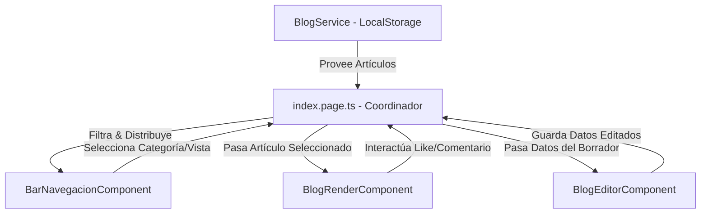

# Guía de Arquitectura: BlogPage en AnalogJS (Comparativa con React + Expo)

Esta guía explica en un lenguaje sencillo cómo funciona la lógica implementada en nuestro blog de **AnalogJS**, qué es el decorador `@Component`, y cómo se compara cada concepto con el mundo de **React + Expo** para facilitar tu comprensión como arquitecto de computación.

---

## 1. ¿Cómo funciona la lógica de la "BlogPage"?

La lógica se divide en tres niveles: la **persistencia de datos**, la **coordinación de pantallas** y la **representación visual**:



*   **Capa de Datos (`BlogService`)**: Actúa como nuestra base de datos local. Al iniciar el componente, carga el contenido almacenado en el `localStorage` del navegador. Si está vacío, inyecta 5 artículos de ejemplo ("datos semilla"). También maneja las acciones del usuario como agregar comentarios, dar "Me gusta", calcular artículos relacionados y guardar nuevos borradores.
*   **Cordinador de Vistas (`index.page.ts`)**: Es el "cerebro" o la pantalla principal. Controla qué vista se está mostrando mediante señales (`signals`):
    *   `explorer`: Muestra el listado de tarjetas de noticias.
    *   `viewer`: Abre la ficha detallada de un artículo.
    *   `editor`: Abre el editor visual (Editor.js) para redactar o modificar un artículo.
*   **Componentes Visuales**: 
    *   `BarNavegacionComponent`: La barra lateral que filtra artículos por categoría.
    *   `BlogRenderComponent`: Lee los bloques JSON de EditorJS y los traduce a HTML visual.
    *   `BlogEditorComponent`: El formulario para escribir títulos y usar el editor interactivo.

---

## 2. Entendiendo el `@Component` en Angular vs. React + Expo

En **React/Expo**, un componente es simplemente una función de JavaScript que retorna JSX (código visual). 
En **Angular/AnalogJS**, los componentes son clases de TypeScript decoradas con `@Component`.

El `@Component` es un **decorador** (un configurador). Le dice a Angular: *"Ey, esta clase de TypeScript no es una clase cualquiera, es un componente visual y quiero que lo configures con estos parámetros"*:

```typescript
@Component({
  selector: 'app-home',
  standalone: true,
  imports: [BarNavegacionComponent, BlogRenderComponent, BlogEditorComponent],
  template: `...`,
  styles: `...`
})
export class HomePage { ... }
```

### Explicación de sus propiedades y su equivalencia en React + Expo:

| Propiedad en `@Component` | Qué hace en Angular | Equivalente en React / Expo | Explicación en Lenguaje Simple |
| :--- | :--- | :--- | :--- |
| **`selector`** | Define la etiqueta HTML personalizada con la que llamaremos al componente. | El nombre de la función del componente (ej. `<BarNavegacion />`). | Si configuras `selector: 'app-bar-navegacion'`, en tu HTML lo invocarás escribiendo `<app-bar-navegacion></app-bar-navegacion>`. |
| **`standalone: true`** | Indica que el componente es autónomo y no depende de módulos pesados de Angular. | Todos los componentes en React son "standalone" por defecto. | Permite que el componente se pueda importar y usar directamente, facilitando un desarrollo ágil y limpio. |
| **`imports`** | Lista los otros componentes, directivas o botones que se van a usar dentro de su HTML. | Las declaraciones `import Componente from './Componente'` al inicio del archivo React. | En Angular Standalone, debes declarar explícitamente en `imports` cada componente secundario que quieras usar en tu plantilla HTML. |
| **`template`** | Es la estructura HTML de la interfaz del componente. | El bloque `return ( <View> ... </View> )` escrito en JSX. | Aquí escribes el marcado estructurado de tu pantalla. En lugar de usar elementos móviles como `<View>` o `<Text>` (Expo), usas etiquetas web tradicionales como `<div>`, `<header>`, `<h1>`, etc. |
| **`styles`** | Contiene las reglas CSS aplicadas únicamente a este componente. | El objeto creado con `StyleSheet.create({ ... })`. | Angular aísla estos estilos por defecto (encapsulamiento). Lo que escribas en `styles` solo afectará a este componente, exactamente igual que el `StyleSheet` de Expo que no se filtra a otros componentes. |

---

## 3. Comparativa conceptual: AnalogJS vs. React + Expo

Si vienes de desarrollar aplicaciones en Expo (móvil), aquí tienes una traducción directa de conceptos:

### A. Estado Reactivo: Signals vs. useState
*   **En Expo (React)**: Usas `const [activeView, setActiveView] = useState('explorer')`. Cuando llamas a `setActiveView`, React re-ejecuta **toda** la función del componente para ver qué cambió en el DOM virtual.
*   **En AnalogJS (Angular)**: Usas `activeView = signal('explorer')`. Las **Signals** son valores reactivos inteligentes. Cuando cambia su valor, Angular sabe exactamente qué minúsculo nodo del HTML real depende de esa señal y lo actualiza directamente, sin re-evaluar todo el componente.

### B. Valores Computados: computed() vs. useMemo()
*   **En Expo (React)**: Si tienes una lista y quieres filtrarla, usas `const filtered = useMemo(() => list.filter(...), [list, query])`.
*   **En AnalogJS**: Usas `filteredArticles = computed(() => { ... })`. No necesitas declarar dependencias; la señal computada detecta automáticamente qué señales leíste en su interior y se recalcula sola cuando alguna de ellas cambia.

### C. Comunicación: Inputs/Outputs vs. Props
*   **En Expo (React)**: Envías datos y funciones callback por props: `<Card title={item.title} onPress={() => select(item)} />`.
*   **En AnalogJS**: 
    *   Los datos entrantes se definen con **`input()`**: `article = input<Article>()` (Equivale a recibir un prop).
    *   Los eventos salientes se definen con **`output()`**: `articleSelect = output<Article>()`. En el HTML del padre escuchas el evento usando paréntesis: `(articleSelect)="miFuncion($event)"` (Equivale a pasar un callback).

---

## 4. Cumplimiento de las Consignas del Proyecto (Cátedra)

Nuestra implementación cumple rigurosamente con los requerimientos estructurales solicitados:

### A. Entidad Central con Relación de Pertenencia (1:N)
*   **Entidad Central**: `Artículo` (Article) en [blog.type.ts](file:///Users/aldanabiondi/Documents/Pablo%20Donato/UNIVERSIDAD/TALLER/Taller%20DEMO/test-analog/blogpage/src/app/types/blog.type.ts).
*   **Relación de Pertenencia (1:N)**: **Un Artículo posee muchos Comentarios**.
    *   En el tipo `Article` definimos `comments?: Comment[]`. Cada artículo tiene su propio arreglo de comentarios embebidos.
    *   En `BlogService`, la función `agregarComentario()` localiza el artículo por su ID e inserta un nuevo objeto comentario en su lista.
    *   En `BlogRenderComponent`, iteramos los comentarios de la entidad correspondiente con `@for (comment of article().comments; track comment.id)`.

### B. Incorporación de Relación Muchos a Muchos (MxN)
*   **Relación MxN**: **Artículos $\leftrightarrow$ Etiquetas (Tags)**.
    *   Un Artículo puede tener múltiples etiquetas (ej: `['Clima', 'ASEAN', 'Sostenibilidad']`).
    *   Una misma Etiqueta (ej: `'Clima'`) puede estar asociada a múltiples artículos independientes en el sistema.
*   **Aplicación Práctica de la Relación**: Esta relación muchos a muchos se aprovecha para el sistema de recomendación del blog. Cuando visualizas un artículo en el `BlogRenderComponent`, el servicio ejecuta el método `obtenerArticulosRelacionados()`. Este algoritmo calcula la coincidencia de etiquetas compartidas (intersección MxN) y de categorías, ordenándolos para mostrar las mejores sugerencias al lector.

### C. Navegación a la Ficha del Elemento (Detalle)
*   En la vista de exploración (`explorer`), cada tarjeta de artículo tiene un evento de clic: `(click)="viewArticle(art)"`.
*   Al hacer clic, la pantalla principal actualiza el estado de la aplicación seteando la señal `selectedArticle.set(article)` y cambiando la vista a `viewer`.
*   El panel de trabajo oculta la cuadrícula y renderiza el componente `<app-blog-render [article]="selectedArticle()!" />`, mostrando de manera detallada todos los atributos del elemento (título, autor, imagen de portada grande, bloques redactados y caja de comentarios).
